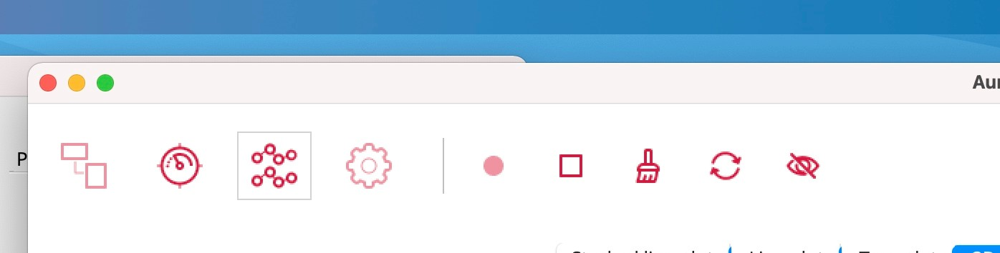

How to stream noise
===================

(i.e., no participant needed)

Eyetracker (iMac)
-----------------

1. Connect device via USB
2. Open “pupil capture” application on desktop of iMac
3. Hit the record button (R on left bottom of screen)

fNIRS (iMac)
------------

1. Connect sources & detectors to NIRSport (white box)
2. Open Aurora application on desktop of iMac
3. Select montage (1Person)
4. OPTIONAL: run calibration (triangle button on calibration screen)
5. Click on diagram symbol, then start recording by clicking the circle

   |calibration|

EEG (Windows)
-------------

1. Connect battery (grey box) to amp (other grey box) by placing
   underneath and plugging teal cord in (arrows up)
2. Connect electrode set and ground to amp
3. Open LSL streaming app on Windows machine (up to 3 instances)
4. Enter the device serial number and click ‘link’, start with leopard,
   then lion, then tiger
5. If failed, unlink all devices from LSL, close all instances of LSL
   and repeat until all 3 devices are connected

After recording
---------------

**ALWAYS unplug the EEG batteries from each Amp and connect back to
their chargers**

