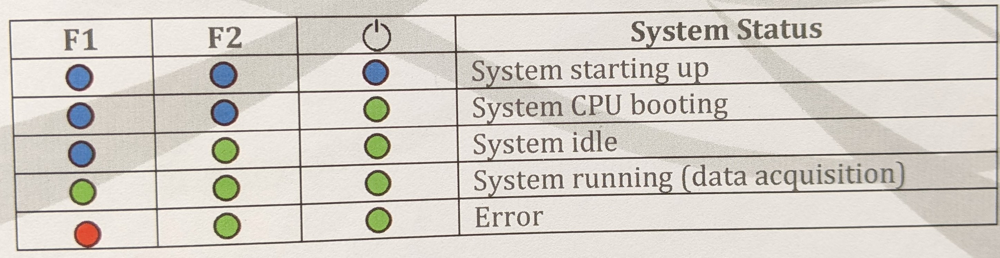

Troubleshooting
===============

You finally have the participants in, but something just doesn’t work.
Find some common strategies to trouble shoot here

| **STAY CALM! We are all humans, and the calmer you are the calmer the
  participant will be**
| **Do not blame yourself, your colleagues and/or the participant(s)** #
  General TIPS \* **Assure the participant(s) that the issues are not
  their fault or reason for concern.** \* Ask others for help. Sometimes
  a fresh pair of eyes can see more clearly. \* Keep calm and
  systematically try to narrow down what the source of the problem could
  be. If it is a technical problem, we need to have as much information
  as possible to fix it, so investigate. \* If you can, take a
  screenshot of any abnormality/error message so we know what exactly
  the problem looked like. > on iMAC: shift + command + 3 (will
  automatically save to desktop)
| > on PC: Control + Alt + PrtScn (need to paste into program,
  e.g. Paint) \* If one thing doesn’t work, so be it. Let’s focus on the
  other parts of data collection. If the entire setup is not working and
  your team cannot find a solution, consider sending the participants
  home with full pay. \* Always update the lab manager/PIs about
  persisting or recurring problems with the equipment.

EEG troubleshooting
-------------------

Technical Issues
~~~~~~~~~~~~~~~~

1. Check software!

   -  Restart BrainVision Recorder (close application, open again),
      check for interfering applications)
   -  Switch between impedance mode and visualization mode in
      BrainVision Recorder (eye and lightbulb buttons)

2. Check connections!

   a. Unplug everything (both electrode sets and ground from the amp,
      battery from amp)
   b. Plug everything back in, checking that all connections are stable
      (battery cable connects to both, amp and battery)

3. Check equipment!

   -  Check that there is no tension on cords (Cables from electrodes to
      boxes, boxes safely attached to participant, no interference with
      cables, grey cables not under tension (move amp)
   -  Try swapping the ground with the unused ground (if possible)
   -  Try swapping the battery with the other battery (if possible)

4. Check participant!

   -  Take an alcohol or shampoo-swap, clean their skin of gel and other
      residue (makeup, sweat, etc) and see if connection improves. (This
      works only on areas free of hair)

-  **DO NOT** set up a different cap for the participant. Once the
   participant has gel in the electrodes, we can no longer swap it. Try
   to solve the problem with what you have.

Signal issues
~~~~~~~~~~~~~

-  Muscle artifacts: Participant may be moving, (wiggling or crossed
   legs), sneezing excessively, chewing gum, swallowing, have tension in
   their jaws, etc. Ask them to relax, politely explain why we need them
   to stop.
-  Glasses: Have glasses on top of cap. Try adjusting their position to
   not interfere with electrodes. If not possible to stop interference,
   make a note about the affected electrodes.
-  Sweating: if the participant is excessively warm or sweating, try to
   fan air to them.

   a. consider asking a few people of the team to leave the room. If the
      room is too warm, all signals will degrade. > optimal temperature
      is <70F

-  Overall bad electrode connection: Work on ground and ref (green 24)
   first. If after 20 min of wiggling, there is no hope, don’t record
   their EEG. Sometimes, there just is not a good connection, because
   the participant may be stressed or have too thick or thin hair, or
   because they showered too recently or not recently enough, or other
   factors outside of the scope that we can fix. **Let participant know
   this is not their fault!**
-  Particular electrode connection: do two things:

   a. Take a note in session notes
   b. Notify the lab manager

fNIRS troubleshooting
---------------------

-  Cannot perform calibration, all connections show up as grey or red:
   restart AURORA & DEVICE

   -  close all instances of Aurora, you might need to right click and
      choose “force quit”
   -  shut down the device by pressing the ON/OFF button at the back of
      the port (left side) for 5 sec (until you hear a beep)
   -  unplug everything
   -  turn device back on by pressing the ON/OFF button for 1 sec (you
      will hear another beep)
   -  plug everything in again
   -  start Aurora

-  Connections are listed as yellow or red during calibration, cannot be
   lowered

   -  try using ultrasound gel (clear gel) on the affected optodes.
      Apply with syringe, distribute with Q-tip
   -  try moving the optodes on the head to move hair out of the way.
      Move cap or individual optode

-  Aurora throws an error and stops recording

   -  Close all instances of Aurora (you might need to right click and
      choose “force quit”)
   -  reopen Aurora, calibrate, then record

-  Aurora not detecting optodes

   -  always use the top row to attach sources and detectors (column

      A) 

-  NIRSport device not working

   -  check the back of the device.

      -  A working device has two green and one blue lights.
      -  A recording device has three green lights
      -  A red lights means you need to restart the device (press ON/OFF
         button for 5 sec until it beeps to turn off, then press again
         to turn back on) |nirs|

eyetracking troubleshooting
---------------------------

-  If eyetracker does not calibrate, move the camera facing the screen
   to capture the entire computer screen and calibrate again

   -  entire iMAC screen should be centered in the front camera, after
      calibration, it should be within the green box

-  If eye-windows do not open, click on settings (top right) and select
   “detect eye 0” & “detect eye 1”

*NOTE If a person wears glasses, we cannot use the eyetracker*

others
------

