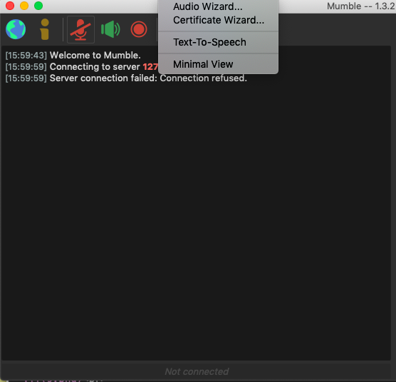
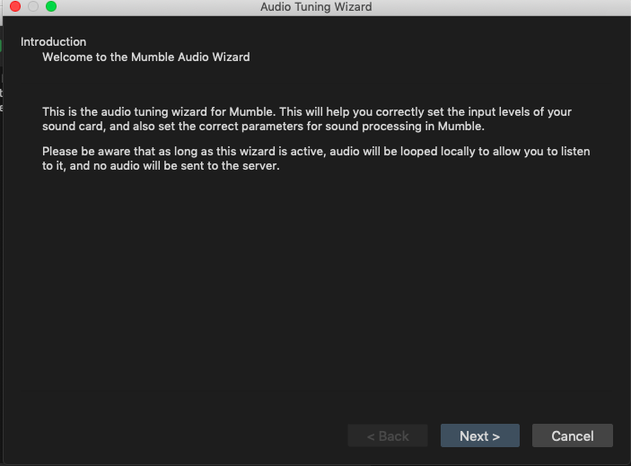
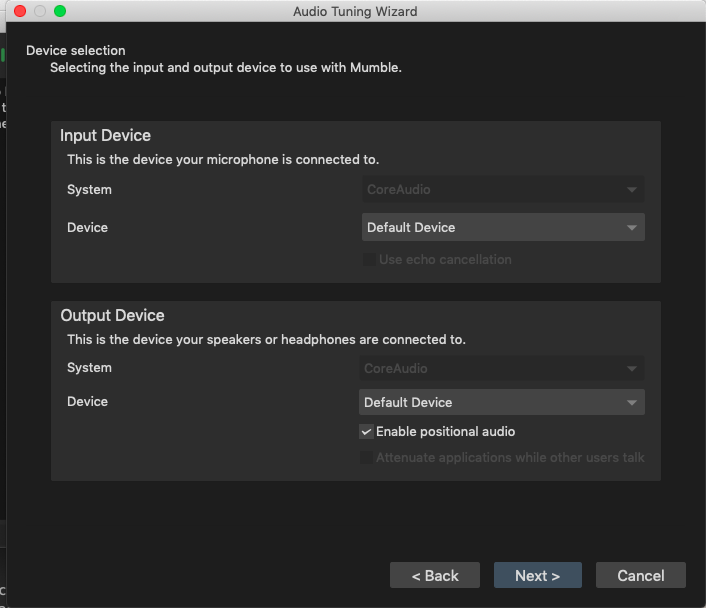
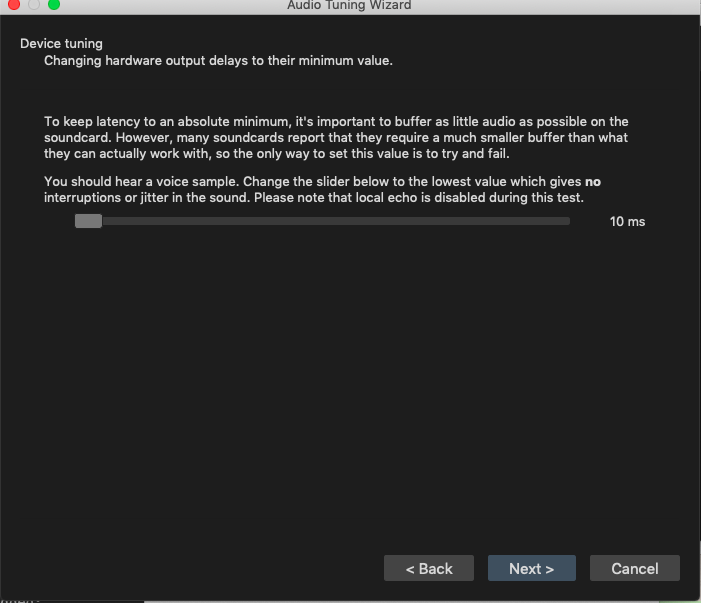
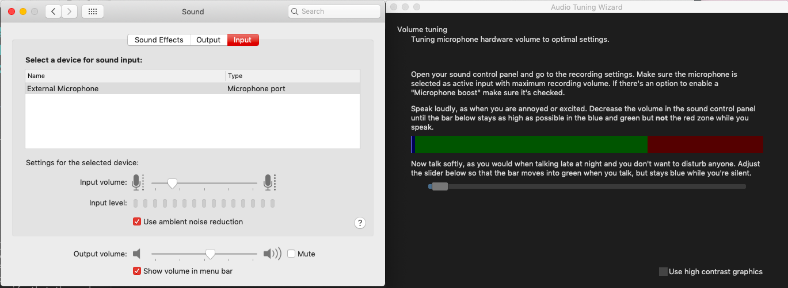
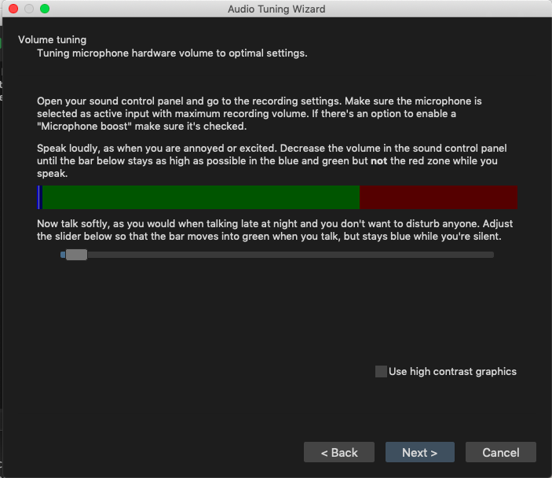
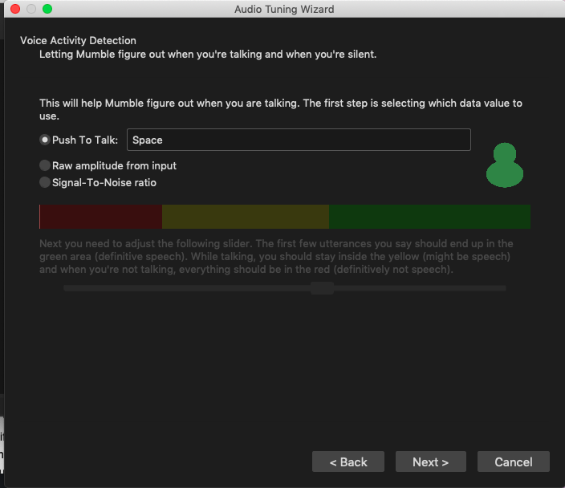
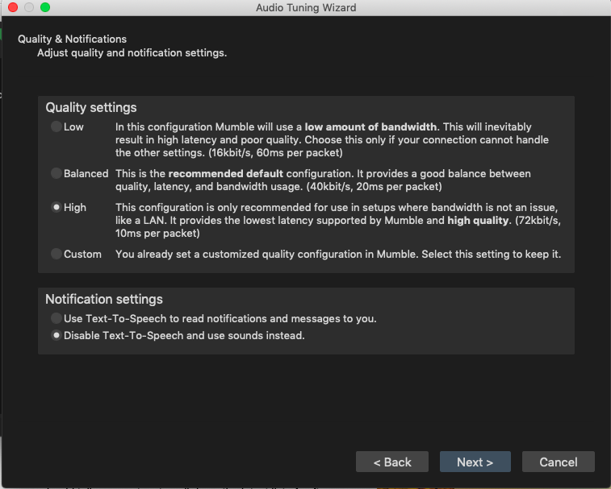
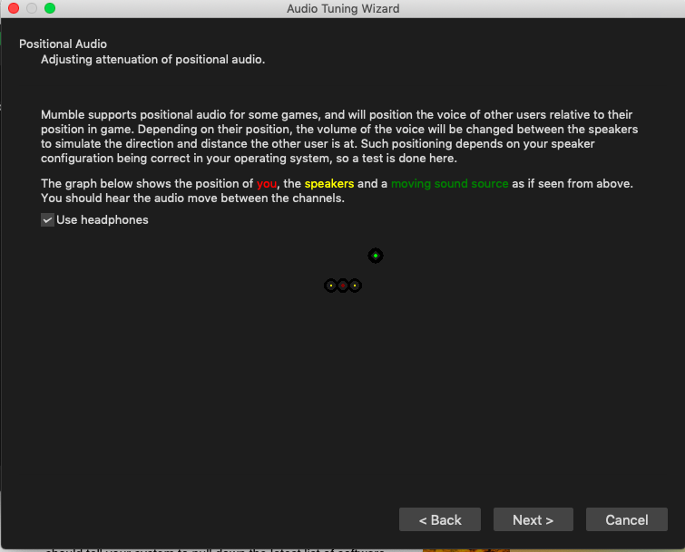
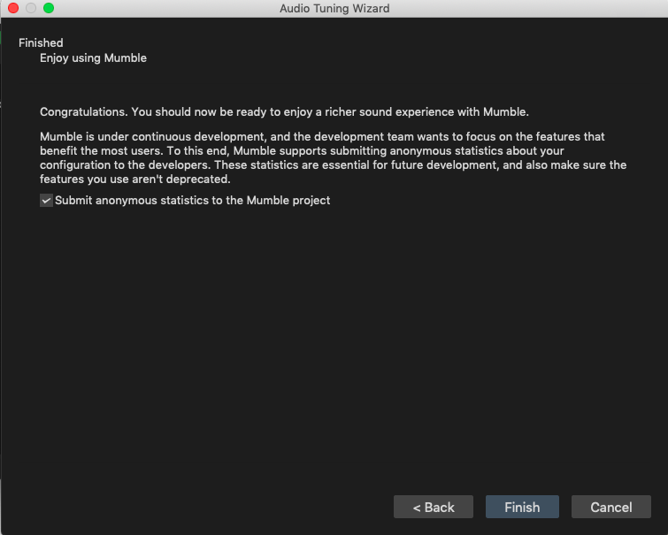

Set-up instructions for Mumble Audio Wizard
===========================================

1. In the top panel, click on Configure > Audio Wizard… |image1|
2. Click ‘next’ on the first page of the setup: |image2|\ 
3. Device selection: ‘default’ option: |image3|\ 
4. Volume tuning: choose lowest value(default 10ms, lowest) |image4|\ 
5. Voice Activity detection: Here, keep the Control Panel also open:
   |image5|\  While following the instructions, remember to lower the
   input volume in the control panel so that when you speak with a loud,
   excited tone, the bar stays in the blue/green zone. |image6|
6. Voice Activity Detection: to setup up Push to Talk, click on th text
   box next to ‘Push to Talk’ and click on a suitable shortcut on your
   keyboard. |image7| For continuous recording, ‘Raw Amplitude’ gave
   better speech detection results. Adjust the slider until your speech
   is in the yellow or green zone.
7. Quality and notifications: Custom setting is appropriate if one
   anticipates bandwidth issues and has setup a custom value in
   ``murmur.ini``. Else, choose ‘high’. Disable Text-to-speech, so that
   the recording is not interrupted by the TTS: [Note: TTS can also be
   disabled from the ‘configuration’ option in the Mumble toolbar.]
   |image8|\ 
8. Positional Audio: click ‘Next’ |image9|\ 
9. Click ‘Finish’ on the last page: |image10|\ 

