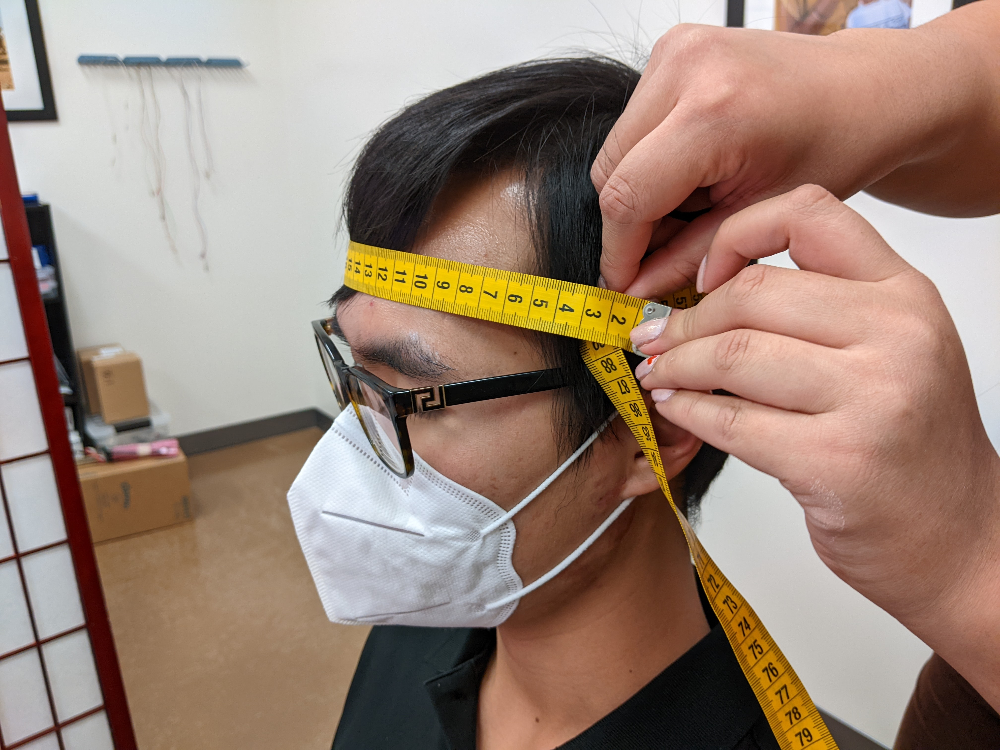
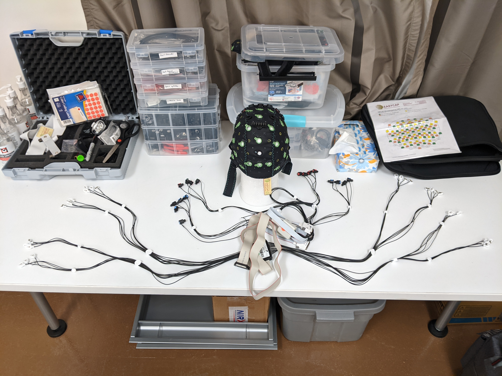
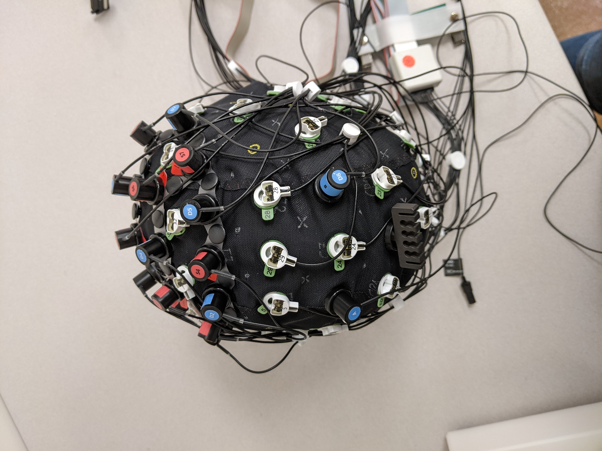
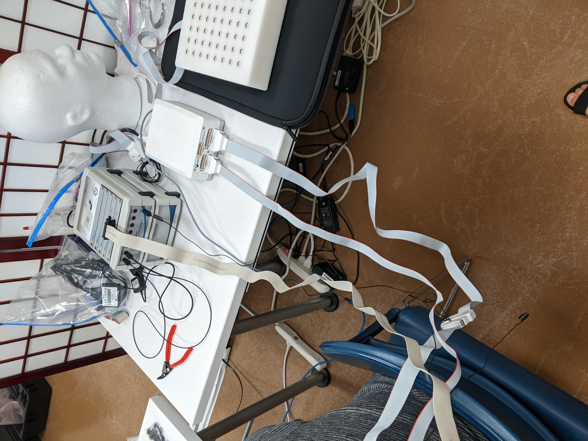
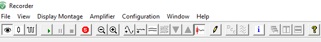

Cap setup
=========

This is a general setup guide. For troubleshooting, check here:
`Troubleshooting <https://github.com/val-pf/tomcat-equipment-wiki/wiki/Troubleshooting>`__

Measuring head size
-------------------

| measure head by pulling tape around circumference of head, widest part
  of head – above eyebrows & parallel to the ground – most women: 56cm;
  most men: 58cm >Most frequent sizes: 54, 56, 58, 60
| >Available sizes: 50, 52, 54, 56, 58, 60, 62

*Finding a cap’s size: last two digits on top row of cap label specify
the size* |measuring the headsize|

Setup of the cap (holds EEG/fNIRS)
----------------------------------

|Cap setup| 1. Put cap on Styrofoam head, and separate out electrodes -
Lower numbers will be on the left (1-16), higher numbers on the right
(17-32) - Slide electrodes in holders & match up numbers - Make sure
cables run downwards-backwards - Put Velcro ties on both sides when done
(1-16 in one bundle, 17-32 in the second) 2. Take out optodes and push
them into correct color numbers - Red = sources, blue = detectors,
doesn’t matter which ones you start with - Easier if you stand up, can
also put fingers under cap to help - White optode holder = “phantom
head” - Accelerometer on left, D8 on right of Cz) 3. Put in ground
electrode (black holder) |completed cap| ### You have completed the cap
setup! Now, the cap needs to be placed on the participant’s head.

.. _putting cap on participant:

Putting cap on participant
--------------------------

#. Have participants take off earrings & glasses, wipe forehead & front
   of ears with baby shampoo
#. Hold cap from front – back (person 1) and left-right (person 2), make
   sure front of cap is close to eyebrows
   *  Look at participant - cap should be symmetrical
#. Put green Velcro holders on optode bundles & attach to participant’s
   shirt, attach electrode splitter box to shirt
   *  May need to place on the side where the amp/port are)
#. Hook up ground and electrode cable to amplifier (gray box, don’t
   forget battery)
   *  Connect HR and skin conductance electrodes |hook up|
#. Hook up optodes to the port (smaller, white box)
   6.Open Aurora (rainbow brain) app on IMAC

   *  Tomcat_aug
   *  Hit triangle/play symbol for calibration
   *  Try to get all signal to be green by shimmying, massaging the
      optodes on cap, or applying the clear ultrasound gel
   *  When done, hit the line plot symbol, then the circle to start
      recording |calibration|

--------------

Find PID for Aurora and grant it priority
~~~~~~~~~~~~~~~~~~~~~~~~~~~~~~~~~~~~~~~~~

-  When Aurora is running, open activity monitor app and find Aurora,
   note down PID (e.g. 1228)
-  Open blank terminal (right click) and type: ``sudo renice -10 [PID]``
   *e.g.: sudo renice -10 1228*

--------------

#. Measure cap position to make sure it is centered
   *  Measure from ear to ear, take half of the distance = green 24
      should be there
   *  Measure from nasion (between eyebrows) to inion (bump at back of
      head) and Cz (green 24) should be at middle point

#. Start BrainVision Recorder on desktop PC , hit lightbulb symbol for
   lights, eye for traces |brain vision|
#. Put tips on syringes & start putting gel in opening of electrodes –
   try to aim down and under electrode, then wiggle in circles until it
   turns green
   *  Optional: open photobooth app so participant can see
   *  Normal for colors of electrode lights to change as you move

.. _skin conductance and hr:

Skin Conductance (GSR) & Heart Rate (ECG)
-----------------------------------------

*Make sure battery is connected to EEG-Amp. Turn on PC, open Brain
Vision Recorder app*

### Skin Conductance

#. Grab two white wires, add a good amount of white gel to the center.
#. Attach tape to sensors and attach to participant’s scapula (shoulder blade)
   leaving about two fingers' distance between sensors.
   * Make sure wires face up and go over shoulder.
#. Attach wires to box with two holes
   * double-click GSR in Brain Vision software in trace mode (eye-symbol)
   * zoom in if needed

Heart Rate
~~~~~~~~~~

#. Grab black wire (ground) and two colored wires
#. use double-sided circles (stickers), remove only white backing
   *  put electrode with thinner side on the sticky end
#. Attach on participant
   *  black wire: under left collarbone with wire facing up and over the
      shoulder
   *  colored wires:
      *  one under the right collarbone -> goes in MINUS
      *  the second one below ground under chest (left side) -> goes in
         PLUS
#. **FILL all three electrodes with ABRALYT gel (grey, grainy gel)**
   *  cover each electrode with tape to avoid staining participant’s
      clothes
#. Attach to box with three holes, ground in middle
   *  Double-click ECG in Brain Vision software in trace mode
      (eye-symbol)
   *  Zoom out if needed

.. |calibration| image:: fnirs_calibration.jpg

