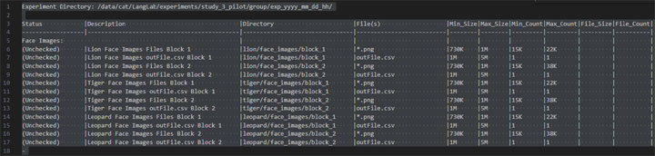
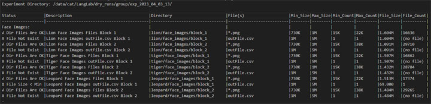
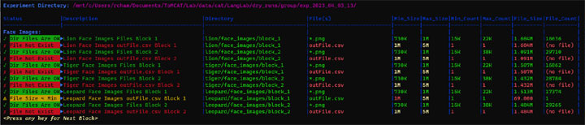
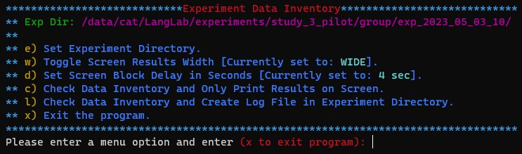

Experiment Data Inventory Program
======================
Developed By: **Rick Champlin** 
Last Modified: **05/10/2023** 
Start Program: ***./data_inventory.sh***
  
## Description: 
This program scans a ToMCAT Experiment Data Directory, checks for and inventories the existence of sub directories, files, and file specifications as defined by the definition file "*data_inventory.tbl*". 
The results of the data checks and analysis that are preformed can either be displayed as continuance looping of file blocks on the screen (menu option "c") or by creating results log files in the Experiment Root Data Directory (menu option "l"). 

**Checks and analysis that the program performs:**
+ The Existence of the Sub Directory.
+ The Existence of the File(s).
+ The File is not Empty (0 Bytes).
+ The File Byte Size is between the defined Min and Max.
+ The File Count in the Sub Directory is between the defined Min and Max.
+ If the Sub Directory is defined to hold multiple Files (*.png), checks the File Byte Size of the last File written into the Directory, is between the defined Min and Max.

## The Definition File ("*data_inventory.tbl*"):
The definition file drives the data inventory checking process. It is a plain text file that can be easily viewed or edited with any text editor (vim, nano, Linux Text Editor, Visual Studio Code, Notepad, cat ...). The file can be edited to modify or add definition rows or block grouping. However, the formatting of the file must be maintained or the program will not function correctly! Column width (number of characters) and columns ending with a bar "|" is critical formating. I used dashes "-" and bars "|" to make it easier to see and keep the columns formated correctly. It is recommended that you make a backup of the file before editing it.

#### Rules for modifying or adding to the Definition File ("*data_inventory.tbl*"):
+ The file should not contain any special characters, escape or color/formating characters/sequences. With the exception of the end of line CR escape characters. 
+ The first 4 lines (Header Lines) should not be altered.
+ The first line (Experiment Directory) does not need to be edited and will be overwritten in the results files by the program with the specified Experiment Directory.
+ The "File Block Title Line" should have a colon ":" at the end of the Block Title and should only be missing the end of column bar for the first column ("Status Column").
+ At the end of a "File Block" there should be a "End of File Block Line". It just have a dash "-" character and nothing else in the line.
+ The last line of the file should be exactly like the "End of File Block Line" with just a dash "-" character and nothing else in the line.

  File(s) Checking and Analysis Specifications Lines:
+ 1st column "Status" - you do not need to enter anything into this column and can be left with "(Unchecked)" in it. The program writes inventory check and analysis into this column when it creates the results files.
+ 2nd column "Description" - enter a short description (keep it in the column size, abbreviate if necessary) describing the file or files that are being checked with this line.
+ 3rd column "Directory" - enter the Sub Directory, under the Experiment Directory, of where the file(s) being checked are stored. If the file(s) being checked are in the root of the Experiment Directory, leave this column blank. To keep this column within its size specification, the wild-card star "*" can be used in a long directory name. The program has an algorithm to resolve a directory name with wild-card(s) in it at processing time.
+ 4th column "File(s)" - enter the Name of the File or the Files Type to be checked in the specified Sub Directory. If the file name has a "star dot something" ( \*.png ) as the name, this tells the program not to look for a specific file, but instead to check for a group of files with the specified ending/type. To keep this column within its size specification, the wild-card star "*" can be used in a long file name. The program has an algorithm to resolve a file name with wild-card(s) in it at processing time.
+ 5th column "Min_Size" - enter the "Minimum Size" in "Bytes" that the file being checked by this line can be. To keep this column within its size specification, you can use a "K" to represent 3 "000" zeros (thousand), a "M" to represent 6 "000000" zeros (million) and a "G" to represent 9 "000000000" zeros (billion). If you use the notation "K", "M" or "G", enter only a whole number in front of the letter and no decimal ("123M" and not "123.45M"). If this line is checking a group of file ( \*.png ), this "Minimum Size" parameter applies to the "Last File" written into the Sub Directory. 
+ 6th column "Max_Size" - enter the "Maximum Size" in "Bytes" that the file being checked by this line can be. To keep this column within its size specification, you can use a "K" to represent 3 "000" zeros (thousand), a "M" to represent 6 "000000" zeros (million) and a "G" to represent 9 "000000000" zeros (billion). If you use the notation "K", "M" or "G", enter only a whole number in front of the letter and no decimal ("123M" and not "123.45M"). If this line is checking a group of file ( \*.png ), this "Maximum Size" parameter applies to the "Last File" written into the Sub Directory. 
+ 7th column "Min_Count" - enter the "Minimum Count" of files in the Sub Directory, based on file type ( \*.png ), being checked by this line can be. To keep this column within its size specification, you can use a "K" to represent 3 "000" zeros (thousand), a "M" to represent 6 "000000" zeros (million) and a "G" to represent 9 "000000000" zeros (billion). If you use the notation "K", "M" or "G", enter only a whole number in front of the letter and no decimal ("123M" and not "123.45M"). 
+ 8th column "Max_Count" - enter the "Maximum Count" of files in the Sub Directory, based on file type ( \*.png ), being checked by this line can be. To keep this column within its size specification, you can use a "K" to represent 3 "000" zeros (thousand), a "M" to represent 6 "000000" zeros (million) and a "G" to represent 9 "000000000" zeros (billion). If you use the notation "K", "M" or "G", enter only a whole number in front of the letter and no decimal ("123M" and not "123.45M").
+ 9th column "File_Size" - leave this column blank. The program will write the actual size, in bytes of the found File being checked into this column in human notation ("123.45M"). If this line is checking a group of file ( \*.png ), this "File Size" is the size of the "Last File" written into the Sub Directory. 
+ 10th column "File_Size" - leave this column blank. The program will write the count of files in the Sub Directory into this column, based on file type ( \*.png ), and in human notation ("123.45M"). 

## The Output Results Files ("*data_inventory.log*" and "*data_inventory.run*"):
The "Output Results Files" are created in the root of the Experiment Directory when the "l" option of the "data_inventory.sh" menu is selected. If the Results Files already exist in the Experiment Director, the program will ask if you want to overwrite them.
+ *data_inventory.log* - is a plain text file that can easily be viewed with any text editor (vim, nano, Linux Text Editor, Visual Studio Code, Notepad, cat ...). The file will be formated for constant column widths and will use bars "|" to keep the columns aligned. The file can be opened as a spreadsheet by specifying to the spreadsheet program to use bar "|" as the delimiter and that the file's first 4 rows are a header.
+ *data_inventory.run* - is a stand alone "bash script". It can be run on the Linux terminal or SSH terminal by running "*./data_inventory.run*". It print on the terminal screen the same Data Inventory Results that are in the *data_inventory.log* file, but with color, headers, and File Blocks formating. 

## The Data Inventory Program Menu:
The Data Inventory Program Menu is opened by running "*./data_inventory.sh*" in the Linux terminal or a SSH terminal.

---